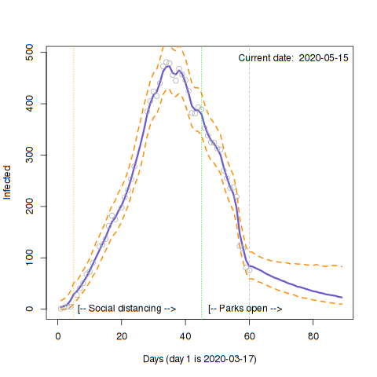
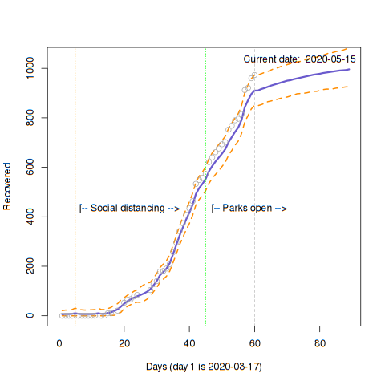
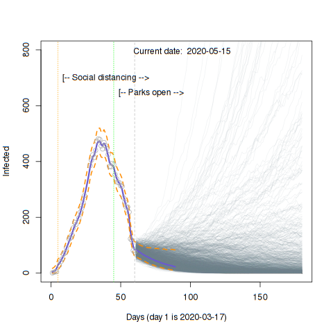

---

# Current COVID-19 status for Nova Scotia:

Here we show a few elements of COVID-19 status in Nova Scotia based on data compiled from publicly available information (https://novascotia.ca/coronavirus/data/). This has been kindly compiled by J. Strang and N. St-Jacques and stored at: https://docs.google.com/spreadsheets/d/1tgf2H9gDmRnGDGeQE-fC9IPhrmNxP8-JC7Nnnob_vuY/edit#gid=1323236978

The following figures are generated from https://github.com/jae0/adapt/blob/master/inst/scripts/example_parameter_estimation_SIR_nova_scotia.R.

The use of smaller areal units in a spatially explicit mode would of course be more informative, however, this is all that is currently available.

The number of cases are modelled as a latent variable in a recursive SIR model and then projected forward using parameter estimates from the last few days of observations, in this case, three days.

I will keep updating this as much as possible.

---


# Infected number of people with simple projections



The number of infected people as a function of time (days; day 1 is 2020-03-17) in circles. Vertical line represents "today". The blue line shown is the model fit to a modified SIR model with 95% Credible Intervals in orange. Simple deterministic (mean-field) forecasts from the recursive model are shown.

---

# Recovered number of people with simple projections



The number of recovered (and dead) people as a function of time (days; day 1 is 2020-03-17) in circles. Vertical line represents "today". The blue line shown is the model fit to a modified SIR model with 95% Credible Intervals in orange. Simple deterministic (mean-field) forecasts from the recursive model are shown.


---

# Current reproductive number


The current estimate of the reproductive number (posterior distribution). There is still a non-zero probablity that the Reproductive number is larger than 1 (red line), but the majority of the distribution is currently below 1.


---
# Forecast with stochastic simulations



Finally, individual trajectories of stochastic simulations are shown. These are based upon the joint posterior distributions of the parameter estimates for the most "current day", obtained from the above analysis. These trajectories represent possible futures, accounting for small number stochasticity (unlike the mean-field ODE-based "forward" predictions), assuming the current "situation" (i.e., control measures and population behaviours ecapsualted in the joint-posterior distributions of the model parameter) remains constant/consistent. The majority of the trajectories suggest a continued decline in the number of infected people. Nonetheless, there still exists some scenarios of rapid disease outbreak.


---

# What is "adapt"?

A set of routines to analyze publicly available disease epidemic data such as COVID-19 that you can customize for your town, province or state or country. This data tends to be rather crude counts of cases and recovered people and deaths. Your area of interest probably has these announcements and the information is likely captured by concerned citizens. To make sense of this information, beyond the daily ups and downs, you need to model it.

A basic model appropriate for such crude data is the SIR (Susceptible-Infecter-Recovered) compartmental model. This is a well understood model that has its share of limitations but still sufficient to get a crude sense of what is going on. Look it up if you want to know details. The programs here are used to fit a variation of this model to the crude data, as best we can. It relies upon some advanced statistical and mathematical engines developed by opensourced, cutting edge (R, STAN, SimInf, and many others, see below) and approaches the problem as a "latent, state-space" model, often encountered in fisheries-modelling problems. Use of "adapt", however, requires only some minimal understanding of programming, mostly R (https://cran.r-project.org/).

If you just want to get a sense of what things are like for your area of interest, you need to change only the data. Right now, it is accessing a Google sheet that stores the required information:

https://docs.google.com/spreadsheets/d/1tgf2H9gDmRnGDGeQE-fC9IPhrmNxP8-JC7Nnnob_vuY/edit#gid=1323236978

This data was manually compiled and upated by J. Strang and N. St-Jacques. You can use this as a template. Alternatively, you can estimate the number of infected people on a daily basis ("InfectedCurrently" in the spreadsheet) as well as the cummulative number of "Recoveries" and "Deaths" and dates. You will also need the total population size of your area of interest. Look inside the function (https://github.com/jae0/adapt/blob/master/R/data_nova_scotia.R) to see how it is done here. Use the Nova Scotia example as a template. Thereafter, you can probably run the short code in https://github.com/jae0/adapt/blob/master/inst/scripts/example_parameter_estimation_SIR_nova_scotia.R with minimal modification.

Please note: No guarantees are being made here. There are always errors in models, programs that implement such models and in the data itself. However, this is a functional way of helping make sense of information such that we can engage in more informed discussions with your community on next steps in these trying times.

Good luck,

Jae

---

# Installation

adapt (Areal Disease Analysis and Predicion Tools) attempts to assimilate disease spread data for COVID-19 and other similar diseases and estimate model parameters of classical epidemiological models using Bayesian methods (MCMC via STAN: https://mc-stan.org/) and then simulate/forcast disease progression using stochastic simulation modelling approaches (via the Gillespie method, implemented beautifully by SimInf: https://github.com/stewid/SimInf). Small area-based approach using CAR/BYM models (via INLA) are also used to model and support spatial patterns (this part is not yet developed).

To install you need to install R, and then bootstrap from github directly:

```
  remotes::install_github( "jae0/adapt" )
```

and also the Rpackages, "rstan" and "SimInf". They will pull in their own dependencies.
